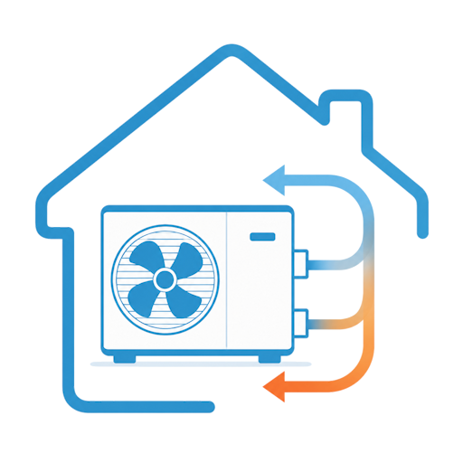
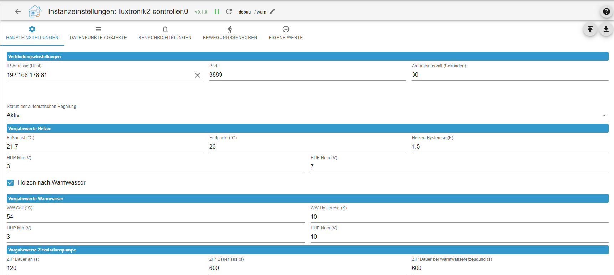
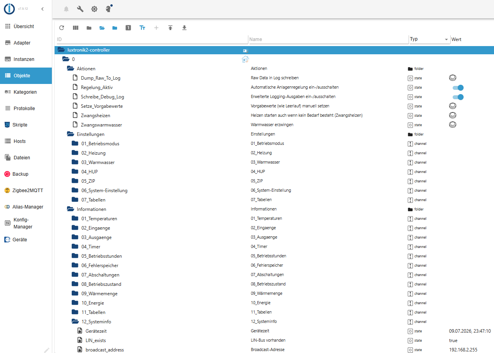
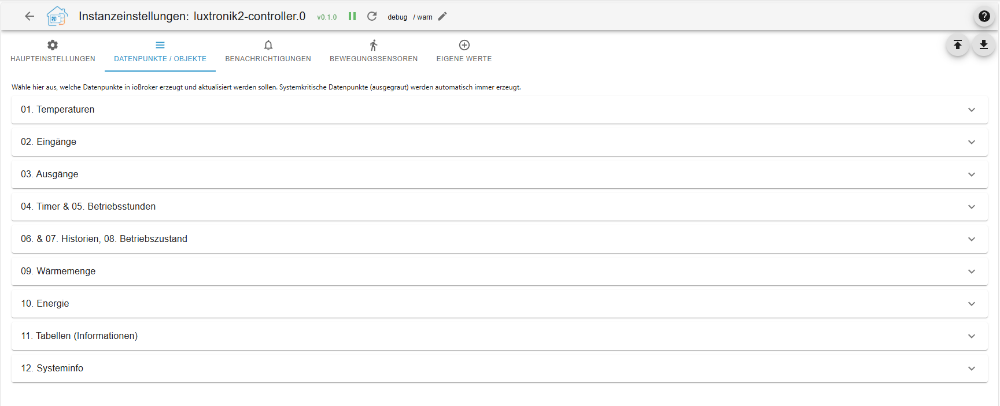
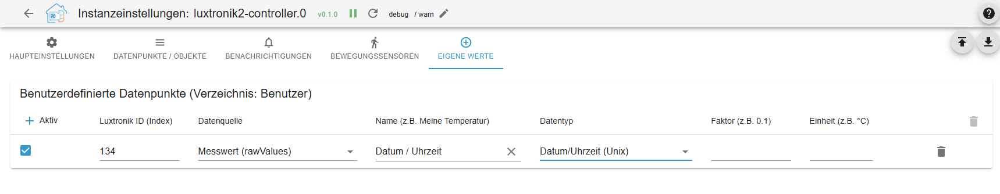
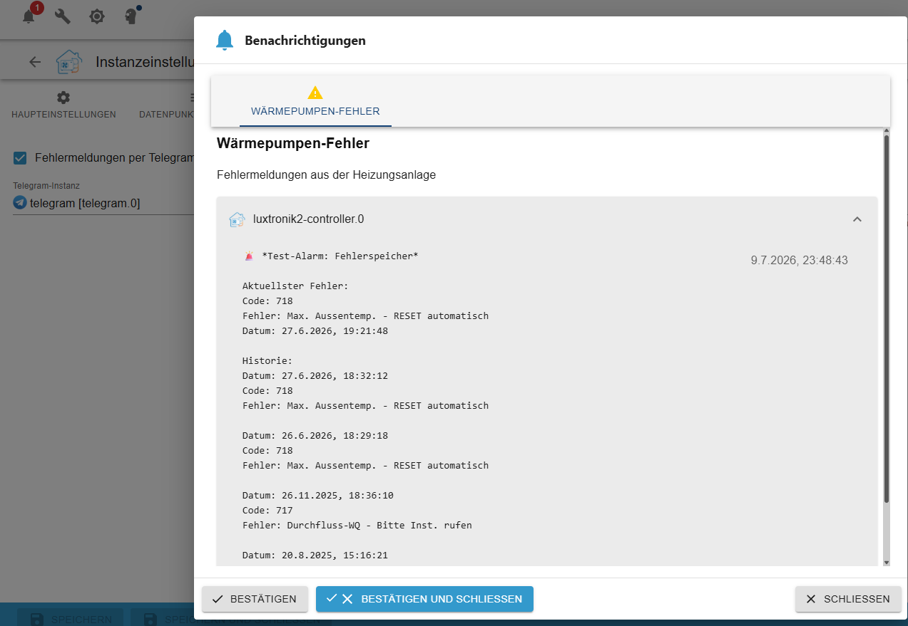
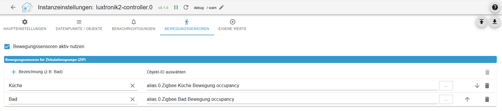

# ioBroker.luxtronik2-controller

**Tests:** 

## luxtronik2-controller adapter for ioBroker

This ioBroker adapter enables the local control and monitoring of heat pumps with [Luxtronik 2.x controllers](https://www.alpha-innotec.com/en/products/accessories/control/luxtronik) (e.g., Alpha Innotec, Novelan). The adapter is written entirely in TypeScript.

## Acknowledgements & History

This project builds upon the preliminary work of existing open-source projects. Special thanks go to:

[Bouni](https://github.com/bouni/luxtronik-2) Whose pioneering work and code developments form the essential foundation for communication with Luxtronik controllers.

[Coolchip:](https://github.com/coolchip/luxtronik2) For the fundamental reverse engineering of the Luxtronik network protocol.

[UncleSamSwiss:](https://github.com/UncleSamSwiss/ioBroker.luxtronik2) For the original ioBroker adapter.

Innovations in this version: The luxtronik2-controller natively integrates TCP communication (Port 8888 / 8889) and does not rely on external libraries. Additionally, controlling macros, a logic for compressor protection, and automated datapoint management were implemented.

## Features

- Native TCP communication: Direct connection to the heat pump without additional overhead.

- Compressor protection (Cycle optimization): Combining heating and domestic hot water cycles to reduce compressor starts.

- Integrated actions (Macros): Predefined control logics for forced heating, hot water requests, and the circulation pump (ZIP) incl. automatic fallback to default values.

- Custom datapoints: Measured values (Index 3004) and parameters (Index 3003) can be added via the adapter configuration. Unix timestamps are formatted automatically.

- Automatic object management: Deselected or deleted datapoints and empty folder structures are automatically removed from ioBroker upon an adapter restart.

- Notification system: Heat pump error codes can be sent directly to Telegram or the ioBroker notification system.

- Motion detector coupling: Option for demand-driven activation of the circulation pump via existing ioBroker motion sensors.

## ⚠️ Warning

Some settings provided by this integration can affect the performance of your heat pump. Misconfigurations can cause the controller to enter a fault state, which requires a manual on-site reset.

This project aims to protect your heat pump by restricting the configuration options to safe values. However, no guarantees can be made. Please be careful, consult your Luxtronik manual, and do not change any settings that you do not fully understand.

## 🔧 Compatibility

The integration allows you to monitor and control heat pumps with a Luxtronik2 controller. It works locally without internet access.
It was and is being tested with an LWD50A (LD5) from Alpha Innotec.

## ⚠️ Disclaimer / Haftungsausschluss ⚠️

Dieses Projekt steht in keinerlei Verbindung zu Alpha Innotec, Novelan, ait-deutschland GmbH oder anderen Herstellern. Es handelt sich um ein privates Open-Source-Projekt, das in der Freizeit entwickelt und gepflegt wird. Die Nutzung des Adapters geschieht auf eigene Gefahr.

_This project is not affiliated with Alpha Innotec, Novelan, ait-deutschland GmbH, or any other company. It is a personal project that is maintained in spare time. Use at your own risk._

## Reporting Bugs & Contributing

Bug reports, compatibility notes for specific firmware versions, or feature requests can be submitted via the issue tracker in the [GitHub-Repository](https://github.com/TbsJah/ioBroker.luxtronik2-controller/issues).

## Information

[Info Deutsch](documentation/readme_de.md)

[Info English](documentation/readme_en.md)

## Changelog

// ### **WORK IN PROGRESS**

### **WORK IN PROGRESS**

- Refactoring

### 0.6.3 (2026-07-23)

**Features & Enhancements**

- **External Actor Support for ZIP (100% Flash Safe):** Added the ultimate hardware protection feature. Users can now configure a list of external actors (e.g., Shelly or Zigbee relays) via their object IDs in the Admin UI. When motion is detected, the adapter switches these relays directly, completely bypassing the heat pump and reducing Luxtronik EEPROM write cycles to absolute zero.
- **External Actor Schedule Compliance:** External ZIP actors now dynamically respect the Luxtronik ZIP time tables (Week, 5+2, or Individual days). Motion triggers will be cleanly ignored if they occur outside the permitted time windows, unless the user explicitly checks the "Disable Hardware ZIP Timers" option in the configuration.
- **Hot Water Sync for External Actors:** The adapter now automatically activates external circulation pump relays when the heat pump begins a hot water generation cycle, maximizing comfort at the tap with zero impact on flash memory wear.
- **Global EEPROM Flash Protection (Read-Before-Write):** Implemented a global interceptor for all hardware write commands (`writePumpSafe`). The adapter now caches the current heat pump parameters in real-time and strictly blocks any duplicate or redundant write requests before they are sent over the network.
- **Automated Hardware-Safe ZIP Defaults:** The adapter can now automatically enforce hardware-safe circulation pump schedules upon startup. Accounts for Luxtronik firmware behavior by intelligently setting the first start block to `00:01:00` (60 seconds) to prevent invalid zero-run rejections, while keeping ON-time at `0 min` and OFF-time at `60 min`.
- **Admin UI - Flash Wear Statistics & Guidance:** Expanded the ZIP configuration page with detailed educational information. Added hard data explaining that internal ZIP control causes between 4 and 14 physical write operations per activation, highly recommending the new external actor setup.
- **Write Cycle Monitoring:** Introduced two new virtual data points under System Info (`write_cycles_today` and `write_cycles_total`) to transparently track physical write operations sent to the heat pump. The daily counter automatically resets every night at midnight.
- **Cooling Extension & Intelligent Status:** Comprehensive integration of new cooling data points (e.g., `cooling_status`, `cooling_configured`, `opStateCooling`). Added the dynamically calculated `opStateCoolingString`.
- **Admin UI - Notification Testing:** Added a dedicated "Send Test Message" button to the configuration interface to easily verify Telegram and ioBroker Notification Center setups directly from the UI.
- **Hardened ZIP Macro Execution:** Reaffirmed and secured the ZIP demand-driven macro to exclusively use the deaeration program (Entlüftungsprogramm).
- **New Flow Rate Datapoints:** Added flow rate tracking for the heat source (`flow_rate_heat_source`, ID 173) and cooling (`flow_rate_cooling`, ID 254) to the state mapping.
- **Extended Admin UI:** All newly added cooling data points and the heat source flow rate can now be individually enabled or disabled via new checkboxes in the adapter configuration (`jsonConfig.json`).
- **New Hardware Supported:** Officially added the MSW2-9S heat pump to the model recognition (`HP_TYPES`).

**Bugfixes**

- **Motion Sensor Cooldown Logic:** Fixed an issue where the 10-minute anti-cycling cooldown for motion sensors was perpetually stuck when using external relays. The logic now correctly monitors the virtual `Activate_Zip` state's timestamp instead of the bypassed internal `ZIPout` state.
- **Virtual State Reset:** Fixed a bug where the `Activate_Zip` button/state remained `true` after an external relay timer expired, which broke subsequent cooldown calculations. It now cleanly resets to `false` when the run cycle finishes.
- **External Actor State Detection:** Fixed a logic flaw where the adapter incorrectly checked the internal heat pump state (`ZIPout`) instead of the external relay state to determine if the circulation pump was already running. It now dynamically checks `getForeignStateAsync` for configured actors, cleanly preventing redundant switch commands and allowing silent timer extensions if motion is re-detected.
- **Timer Formatting in Objects:** Fixed a bug where timer schedules (Heating, Hot Water, Circulation) were incorrectly displayed as raw seconds (e.g., `60` or `0`). Applied the internal duration formatter (`isDurationFormat: true`) globally so all time tables natively and persistently display as `HH:MM:SS` (e.g., `00:01:00`) in the ioBroker object tree.
- **Admin UI i18n Compliance:** Fixed missing language definitions (E5611) in the `jsonConfig.json` dropdown menus to strictly comply with the latest ioBroker repository checks.
- **TypeScript/Linter Strictness:** Fixed strictly typed linter errors (e.g., `@typescript-eslint/no-floating-promises`, `no-redundant-type-constituents`, and template literal typings) by correctly handling asynchronous database calls, replacing `any` with `unknown`, and strictly casting types.
- **Missing Imports:** Resolved compilation errors regarding missing helper functions (e.g., `getDpPath`) during module refactoring.
- **Cooling Operating Hours:** Fixed the `hours_cooling` datapoint. The value is now correctly read from real-time telemetry data (`raw_value`), resolving an issue where the timestamp "Jan 1, 1970" was incorrectly shown.
- **Config Cleanup:** Fixed an incorrect identifier in the admin UI (changed `sync_Gerätezeit` to `sync_deviceTime`) and removed unused/dead checkboxes.

**Technical Changes (Under the Hood)**

- **Separation of Concerns (zipManager):** Completely refactored the motion sensor and circulation pump logic. Extracted the event handling and startup initialization out of `main.ts` into `zipManager.ts`. It now also dynamically handles iterations over arrays of external actors.
- **Network Queue Isolation:** Extracted the core transmission queue (`queueWrite`, `processQueue`) from the main adapter class into `rawFunctions.ts`, achieving 100% isolation of TCP/WebSocket network logic from ioBroker state management.
- **Comprehensive Code Refactoring (DRY):** Created dedicated `convert.ts` and `utils.ts` modules to centralize time string formatting (`timeStringToSeconds`, `formatTimerSecondsToTime`) and generic helper functions (`getNumber`, `delay`).
- **Global Time Refactoring:** Centralized the duration and time calculation for status texts in the `updateStatusStrings` function.
- **i18n Support for State Names:** Updated the internal state definition (`name: string | { en: string; de?: string }`) to fully support translation objects, allowing natively translated datapoint names in the ioBroker object tree.

### 0.6.2 (2026-07-17)

**Added**

- Bilingual support (i18n): Full support for English and German (adapter settings, state names, dropdown menus, and dynamic status texts).
- Language selection: Added a new dropdown menu in the adapter settings to freely choose the preferred output language for the ioBroker object tree.
- Firmware 3.x compatibility: Implemented an intelligent fallback system that dynamically calculates the status texts (heatpump_state_string) and runtime (heatpump_duration) from the main operating state. This is required because modern Luxtronik controllers no longer transmit the old LCD text lines.

**Fixed**

- Incorrect heating state (Frost protection): Fixed an issue where a switched-off heating system was incorrectly displayed as "Frost protection". The code now evaluates the correct index for the heating operating state (opStateHeating / 125) instead of incorrectly calculating it via the parameter.
- Timer display: Restored the clean HH:MM:SS formatting in the ioBroker UI without the annoying "s" (seconds) by introducing an internal isDurationFormat flag.
- Timer glitch fixed: When the compressor is idle, 00:00:01 (1 second) was often incorrectly displayed. This is now cleanly filtered to 00:00:00.
- ioBroker Repo-Checker warnings: Added the missing write: true property to the timer table selection states (role: "level") to fix the E1011 error.

**Technical**

- Fixed ESLint warnings (dot-notation) for object properties.

### 0.6.1 (2026-07-17)

- Implemented fallback mechanism: Index 80 lc is used if 117-120 are empty.

### 0.6.0 (2026-07-16)

- Added option to select the display language for state values (English/German)

### 0.5.3 (2026-07-16)

- Resolve issues which are reported by repository checker
- Updates Timers Format
- Time_WPein_akt 00:00:01 --> 00:00:00 if VD1 is false
- Fallback if Firmware > 3 for extStateStr & StateStr

## License

MIT License

Copyright (c) 2026 TbsJah <github.tbsjah@googlemail.com>

Permission is hereby granted, free of charge, to any person obtaining a copy
of this software and associated documentation files (the "Software"), to deal
in the Software without restriction, including without limitation the rights
to use, copy, modify, merge, publish, distribute, sublicense, and/or sell
copies of the Software, and to permit persons to whom the Software is
furnished to do so, subject to the following conditions:

The above copyright notice and this permission notice shall be included in all
copies or substantial portions of the Software.

THE SOFTWARE IS PROVIDED "AS IS", WITHOUT WARRANTY OF ANY KIND, EXPRESS OR
IMPLIED, INCLUDING BUT NOT LIMITED TO THE WARRANTIES OF MERCHANTABILITY,
FITNESS FOR A PARTICULAR PURPOSE AND NONINFRINGEMENT. IN NO EVENT SHALL THE
AUTHORS OR COPYRIGHT HOLDERS BE LIABLE FOR ANY CLAIM, DAMAGES OR OTHER
LIABILITY, WHETHER IN AN ACTION OF CONTRACT, TORT OR OTHERWISE, ARISING FROM,
OUT OF OR IN CONNECTION WITH THE SOFTWARE OR THE USE OR OTHER DEALINGS IN THE
SOFTWARE.

[Older changelogs can be found there](CHANGELOG_OLD.md)
