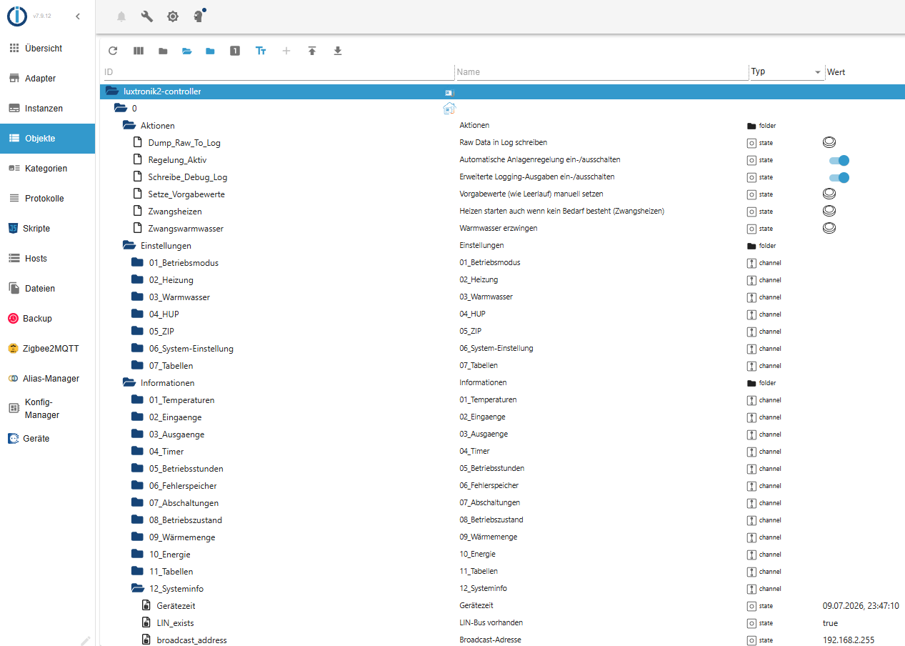
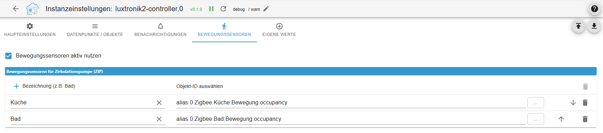

# ioBroker.luxtronik2-controller

**Tests:** 

## luxtronik2-controller adapter for ioBroker

This ioBroker adapter enables the local control and monitoring of heat pumps with [Luxtronik 2.x controllers](https://www.alpha-innotec.com/en/products/accessories/control/luxtronik) (e.g., Alpha Innotec, Novelan). The adapter is written entirely in TypeScript.

## Acknowledgements & History

This project builds upon the preliminary work of existing open-source projects. Special thanks go to:

[Bouni](https://github.com/bouni/luxtronik-2) Whose pioneering work and code developments form the essential foundation for communication with Luxtronik controllers.

[Coolchip:](https://github.com/coolchip/luxtronik2) For the fundamental reverse engineering of the Luxtronik network protocol.

[UncleSamSwiss:](https://github.com/UncleSamSwiss/ioBroker.luxtronik2) For the original ioBroker adapter.

Innovations in this version: The luxtronik2-controller natively integrates TCP communication (Port 8888 / 8889) and does not rely on external libraries. Additionally, controlling macros, a logic for compressor protection, and automated datapoint management were implemented.

## Features

- Native TCP communication: Direct connection to the heat pump without additional overhead.

- Compressor protection (Cycle optimization): Combining heating and domestic hot water cycles to reduce compressor starts.

- Integrated actions (Macros): Predefined control logics for forced heating, hot water requests, and the circulation pump (ZIP) incl. automatic fallback to default values.

- Custom datapoints: Measured values (Index 3004) and parameters (Index 3003) can be added via the adapter configuration. Unix timestamps are formatted automatically.

- Automatic object management: Deselected or deleted datapoints and empty folder structures are automatically removed from ioBroker upon an adapter restart.

- Notification system: Heat pump error codes can be sent directly to Telegram or the ioBroker notification system.

- Motion detector coupling: Option for demand-driven activation of the circulation pump via existing ioBroker motion sensors.

## ⚠️ Warning

Some settings provided by this integration can affect the performance of your heat pump. Misconfigurations can cause the controller to enter a fault state, which requires a manual on-site reset.

This project aims to protect your heat pump by restricting the configuration options to safe values. However, no guarantees can be made. Please be careful, consult your Luxtronik manual, and do not change any settings that you do not fully understand.

## 🔧 Compatibility

The integration allows you to monitor and control heat pumps with a Luxtronik2 controller. It works locally without internet access.
It was and is being tested with an LWD50A (LD5) from Alpha Innotec.

## ⚠️ Disclaimer / Haftungsausschluss ⚠️

Dieses Projekt steht in keinerlei Verbindung zu Alpha Innotec, Novelan, ait-deutschland GmbH oder anderen Herstellern. Es handelt sich um ein privates Open-Source-Projekt, das in der Freizeit entwickelt und gepflegt wird. Die Nutzung des Adapters geschieht auf eigene Gefahr.

_This project is not affiliated with Alpha Innotec, Novelan, ait-deutschland GmbH, or any other company. It is a personal project that is maintained in spare time. Use at your own risk._

## Reporting Bugs & Contributing

Bug reports, compatibility notes for specific firmware versions, or feature requests can be submitted via the issue tracker in the [GitHub-Repository](https://github.com/TbsJah/ioBroker.luxtronik2-controller/issues).

## Information

[Info Deutsch](documentation/readme_de.md)

[Info English](documentation/readme_en.md)

## Changelog

// ### **WORK IN PROGRESS**
### 0.10.1 (2026-09-20)

**🚀 Features & Improvements**

- **(Feature) Heating State String:** Added the configured heating curve parallel offset to the status string (e.g., "Offset +3 °C") for better transparency.

**🐛 Bugfixes**

- **(Fixed) Heating State String:** Corrected a logic issue where the status incorrectly displayed "Reduced 0 °C" during a scheduled reduction window, even if the actual reduction delta was set to 0 K. It now correctly displays "Normal (Timer)".

### 0.10.0 (2026-09-20)

**🚀 Features & Improvements**

- **(Added) Low Flow Outage Alerts:** Implemented active monitoring for "low flow" (Durchfluss) shutdowns in the outage history. The adapter now proactively sends a notification when the heat pump stops due to flow issues, as the controller usually treats these as soft outages rather than hard errors. Includes a 60-minute cooldown to prevent notification spam.
- **(Improved) Admin UI:** Integrated a direct recommendation link for the OpenDTA analysis tool into the description text of the Backup & Diagnostics tab.

**🛠 Chores / Under the Hood**

- **(Fixed) ESLint Validation:** Added missing JSDoc comments in the backup manager to resolve code validation warnings during development.

### 0.9.2 (2026-09-20)

**🛠 Refactoring & Under the Hood**

- **DTA Backup Logic & UI:** Restructured the "Backup & Diagnostics" settings tab. Removed obsolete text log buttons (`procerr`, `procparam`) which are blocked on newer firmwares. Reclassified the DTA manual download buttons into "Live DTA" (forces a new memory flush via `/NewProc`) and "Existing DTA" (fetches the last auto-saved historical log via `/proclog` which might be 2-3 hours old).
- **Automated Backup Naming:** The automated background backup job now dynamically prefixes the downloaded file as either `dta_live_[...]` or `dta_history_[...]` depending on which endpoint was successfully queried, clearly indicating the recency of the data.

### 0.9.1 (2026-09-20)

**🚀 Features & Improvements**

- **(Added) Backup & Diagnostics Tab:** Introduced a new tab in the adapter settings for easy access to heat pump data. Added a recommendation and link for the OpenDTA project to help users analyze their downloaded .dta files.
- **Automated DTA Backup:** Integrated a time-based background cron job to fully automate the retrieval and storage of DTA log files directly into the ioBroker file system.
- **Admin UI Diagnostics:** Added a dedicated "Backup & Diagnostics" tab in the adapter settings featuring manual download buttons for DTA files and system logs, along with a recommendation link for the OpenDTA analysis tool.
- **Intelligent Firmware Fallback:** Improved the DTA download logic to automatically detect the heat pump's firmware version. It seamlessly supports newer models (via `/NewProc`) while automatically falling back to legacy endpoints (`/proclog`, `/procdta`, or `/Webclient/procdta`) for older heat pumps.

### 0.9.0 (2026-09-20)

**🐛 Bugfixes**
🔴 **IMPORTANT:**

- **(Fixed) HUP Dynamic Voltage Control:** Fixed an issue where the digital relay state (`HUPout`) was queried instead of the actual nominal voltage (`heating_system_circ_pump_voltage_nominal`). This previously caused the calculation logic to produce target voltages below the hardware limit (e.g. 1.25V), triggering "less than min 3" validation warnings in the log.
- **(Fixed) Admin UI Backup Links:** Fixed multiple issues with the manual download links in the Backup tab. The IP address placeholder was corrected (from `{host}` to `${data.host}`) to resolve correctly. Additionally, `404 Not Found` errors on newer firmware versions were fixed by routing links to the root web directory (`/procdta`, `/procparam`, `/procerr`) instead of the legacy `/Webclient/` directory.

**🚀 Features & Improvements**

- **(Added) German Translations for Error & Outage Codes:** Added full German translations for all entries in `ERROR_CODES` and `OUTAGE_CODES`.
- **(Improved) Multi-Language History Logs:** The error log (`Fehlerspeicher`) and outage history (`Abschaltungen`) now dynamically output descriptions and fallbacks in the configured adapter language (`de` / `en`).
- **(Added) Backup & Diagnostics Tab:** Introduced a new tab in the adapter settings for easy access to heat pump data.
- **(Added) Manual Downloads:** Added direct buttons to manually download the parameter backup (`procparam`) and error log (`procerr`) via the heat pump's web server. The manual DTA download was split into two distinct steps ("1. Trigger DTA generation" and "2. Download DTA Log") to better reflect the hardware behavior.
- **(Added) Automated DTA Backup & Custom Storage:** Implemented a new scheduling feature (cron) to automatically trigger and download live DTA logs, saving them directly to the ioBroker file system. The default storage location is the root directory of the adapter's file system, but users can specify a custom subfolder (e.g., `backup`) which is automatically created and sanitized.
- **(Improved) Firmware Agnostic Backup Downloads:** The automated DTA backup manager now features an intelligent fallback mechanism. It attempts to download logs from both the root directory (`/procdta`) and the legacy subfolder (`/Webclient/procdta`), ensuring compatibility across all Luxtronik firmware versions (V1, V2, V3).

**🛠 Refactoring & Under the Hood**

- **(Development) TypeScript Definitions:** Added missing `@types/node-schedule` to the dev dependencies to resolve ESLint type-checking errors during the build process.

## License

MIT License

Copyright (c) 2026 TbsJah <github.tbsjah@googlemail.com>

Permission is hereby granted, free of charge, to any person obtaining a copy
of this software and associated documentation files (the "Software"), to deal
in the Software without restriction, including without limitation the rights
to use, copy, modify, merge, publish, distribute, sublicense, and/or sell
copies of the Software, and to permit persons to whom the Software is
furnished to do so, subject to the following conditions:

The above copyright notice and this permission notice shall be included in all
copies or substantial portions of the Software.

THE SOFTWARE IS PROVIDED "AS IS", WITHOUT WARRANTY OF ANY KIND, EXPRESS OR
IMPLIED, INCLUDING BUT NOT LIMITED TO THE WARRANTIES OF MERCHANTABILITY,
FITNESS FOR A PARTICULAR PURPOSE AND NONINFRINGEMENT. IN NO EVENT SHALL THE
AUTHORS OR COPYRIGHT HOLDERS BE LIABLE FOR ANY CLAIM, DAMAGES OR OTHER
LIABILITY, WHETHER IN AN ACTION OF CONTRACT, TORT OR OTHERWISE, ARISING FROM,
OUT OF OR IN CONNECTION WITH THE SOFTWARE OR THE USE OR OTHER DEALINGS IN THE
SOFTWARE.

[Older changelogs can be found there](CHANGELOG_OLD.md)
