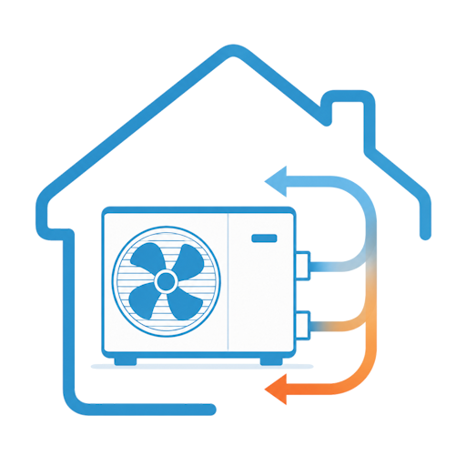

# ioBroker.luxtronik2-controller

**Tests:** 

## luxtronik2-controller adapter for ioBroker

This ioBroker adapter enables the local control, optimization, and monitoring of heat pumps with [Luxtronik 2.x / 3.x controllers](https://www.alpha-innotec.com/en/products/accessories/control/luxtronik) (e.g., Alpha Innotec, Novelan). The adapter is written entirely in TypeScript.

## Acknowledgements & History

This project builds upon the preliminary work of existing open-source projects. Special thanks go to:

- **[Bouni](https://github.com/bouni/luxtronik-2):** Whose pioneering work and code developments form the essential foundation for communication with Luxtronik controllers.
- **[Coolchip](https://github.com/coolchip/luxtronik2):** For the fundamental reverse engineering of the Luxtronik network protocol.
- **[UncleSamSwiss](https://github.com/UncleSamSwiss/ioBroker.luxtronik2):** For the original ioBroker adapter.
- **[BenPru](https://github.com/BenPru/luxtronik) & rhammen:** A special thanks to BenPru and rhammen for their continuous further development regarding the access and control of the Luxtronik controller. Without their dedication, efforts, and ideas, this adapter would not have reached the advanced state it is in today. _(If you appreciate their work, feel free to buy them a coffee! ☕) [BenPru](https://github.com/sponsors/BenPru) [rhammen](https://github.com/sponsors/rhammen)_

**Innovations in this version:**
The `luxtronik2-controller` natively integrates both classic TCP communication (Port `8888` / `8889`) and modern WebSockets (Port `8214` for firmware > V3.81), combined with an optional **Hybrid Modbus TCP** engine (Port `502`) for wear-free RAM writes. Additionally, it features intelligent cycle optimization, dynamic pump control, hardware flash-wear protection, COP/JAZ efficiency tracking, PV-management and automated datapoint management.

### Features

- **Native TCP & WebSocket Communication:** Direct connection to the heat pump via classic TCP (`8888` / `8889`) or WebSockets (`8214`) without external protocol overhead.
- **Hybrid Modbus TCP Support (0% Flash Wear):** Write volatile parameters (target temperatures, heating curves, operating modes) and coils/switches directly into the controller's RAM via Modbus TCP (Port `502`) without wearing out the internal EEPROM flash memory, while continuing to read full telemetry via the native port. Active Modbus states are automatically tagged with `(Modbus)` in the object tree.
- **Hardware & EEPROM Flash Protection:**
    - **Read-Before-Write Cache:** Intercepts and blocks redundant write commands if the controller parameter is already at the target value.
    - **Flash Write Counters:** Transparently tracks daily (`write_cycles_today`) and cumulative (`write_cycles_total`) EEPROM write operations.
    - **Idle Defaults & Interactive Heat Curve:** Automatically restores safe baseline settings when the heat pump enters standby, featuring a live interactive SVG heat curve preview in the Admin UI.
    - **Firmware `.90` Crash Shield:** Automatically detects buggy manufacturer firmwares (`V1.90` / `V2.90`) and blocks network writes to prevent hardware crashes.
- **COP & JAZ (Efficiency Calculator):** Calculate and track heat pump efficiency directly within the adapter (_Today_, _Last 7 Days_, _Current Month_, _Current Year_), automatically split into _Heating_, _Hot Water_, and _Total_. Supports internal Luxtronik counters or high-precision external meters (e.g., Shelly 3EM, M-Bus heat meters) with persistent database storage (`hidden.cop_buckets`) and anti-flapping zero-drop protection.
- **Compressor Protection (Cycle Optimization):** Intelligently links heating and domestic hot water (DHW) cycles to prevent unnecessary compressor stops and starts.
- **Dynamic HUP Control (with Auto-PWM Detection):** Automatically scales the 0–10V control voltage of the heating circulation pump (HUP) based on the supply/return temperature spread. PWM-controlled pumps are automatically detected and bypassed.
- **Smart 3-Way Circulation Pump (ZIP) Control:**
    - Choose intuitively between **Internal Luxtronik Controller**, **External Actor** (e.g., Shelly with 0% flash wear), or **Modbus TCP (Coil 7)**.
    - Trigger circulation on-demand via ioBroker motion sensors/buttons (with anti-cycling cooldown) or synchronously during hot water generation.
    - Includes live virtual status (`Virtual_ZIP_Status`) and a real-time remaining runtime countdown in seconds (`Virtual_ZIP_Remaining_Time`).
- **Integrated Actions (Macros):** Pre-defined triggers for forced heating (`Zwangsheizen`), forced hot water (`Zwangswarmwasser`), circulation (`Activate_Zip`), manual default resets (`Setze_Vorgabewerte`), and full raw data dumps (`Dump_Raw_To_Log`).
- **Smart Object Management & Visibility Filter:** Queries hardware visibility flags (Command `3005`) on startup to automatically hide unsupported system components (e.g., cooling, solar, ventilation, or uninstalled mixing circuits). Deselected categories, datapoints, and empty folders are cleanly removed on restart.
- **Custom Datapoints:** Flexibly add custom telemetry values (Index `3004`) and writable parameters (Index `3003`) via the Admin UI, including custom scaling factors, units, and automatic Unix timestamp formatting.
- **Extended Status Texts & Calculations:** Live calculation of temperature spread, thermal/electrical energy sums, and translated clear-text system states (including heating offsets, frost protection, and cooling status in German or English).
- **Intelligent Notification System:** Dispatches error logs, connectivity alerts, and critical shutdowns (such as water flow rate issues) to **Telegram** and the **ioBroker Notification Center** – including a 60-minute anti-spam cooldown and a live test button.
- **Automated DTA Backup:** Manual one-click links and scheduled Cron downloads of internal `.dta` diagnostic logs directly from the heat pump to `0_userdata.0/luxtronik_backups` for analysis in tools like _OpenDTA_.
- **Broad Compatibility:** Full support for older (V1.x / V2.x) and newer (V3.x) firmware generations using dynamic scaling factors and adaptive write-queue timing.
- **PV Surplus Management (PV-Ready):** Fully integrated, automated solar surplus control. Uses your live grid feed-in to intelligently raise heating and/or hot water setpoints (wear-free via Modbus TCP).
    - **Dynamic Sequence Priority:** Continuously monitors live temperatures and intelligently reroutes power between hot water and heating once the prioritized target reaches saturation.
    - **Hysteresis & Smart Timers:** Customizable start/stop delays and a dedicated stop threshold (Schmitt trigger logic) prevent self-cancelling feedback loops when the heat pump starts consuming the surplus.
    - **Battery Prioritization:** Optionally includes your home battery's charging power in the surplus calculation, treating the heat pump as the primary thermal battery.
    - **Hardware Cycle Protection:** Intelligently waits for an active heating or hot water cycle to naturally finish before reverting setpoints after the sun disappears, protecting the compressor.

## ⚠️ Warning

Some settings provided by this integration can affect the performance of your heat pump. Misconfigurations can cause the controller to enter a fault state, which requires a manual on-site reset.

This project aims to protect your heat pump by restricting the configuration options to safe values. However, no guarantees can be made. Please be careful, consult your Luxtronik manual, and do not change any settings that you do not fully understand.

## 🔧 Compatibility

The integration allows you to monitor and control heat pumps with a Luxtronik2 controller. It works locally without internet access.
It was and is being tested with an LWD50A (LD5) from Alpha Innotec.
It is used by manufacturers such as:

- Alpha Innotec,
- Siemens,
- Novelan,
- Roth,
- Elco,
- Buderus,
- Nibe,
- Wolf Heiztechnik.

## ⚠️ Disclaimer ⚠️

_This project is not affiliated with Alpha Innotec, Novelan, ait-deutschland GmbH, or any other company. It is a personal project that is maintained in spare time. Use at your own risk._

## Reporting Bugs & Contributing

Bug reports, compatibility notes for specific firmware versions, or feature requests can be submitted via the issue tracker in the [GitHub-Repository](https://github.com/TbsJah/ioBroker.luxtronik2-controller/issues).

## Installation

**Note for Raspberry Pi / ARM users:**
You might see red error messages in the installation log related to `node-gyp`, `serialport`, or `usocket`. These are optional dependencies and can be completely ignored. The network-based control (TCP) of the Luxtronik will still work without any issues.

## Information

[Info Deutsch](documentation/readme_de.md)

[Info English](documentation/readme_en.md)
//### **WORK IN PROGRESS**

## Changelog
### 0.22.8 (2026-11-07)

**🐛 Bugfixes & Tweaks**

- **COP & Efficiency Calculation (`copManager.ts`):**
    - **Hot Water Hardware Bug Fallback:** Added a dynamic fallback mechanism to bypass a hardware bug present in several Luxtronik and Novelan firmwares where the internal electrical meter for hot water (`energy_warmwater`) permanently reports `0`.
    - **Smart Delta Routing:** When the heat pump is actively generating hot water (`WP_BZ_akt === 1`), the COP manager now checks if the internal DHW power meter is stuck at zero. If so, it automatically intercepts the delta from the total energy meter (`energy_total`) over the last polling interval and securely routes it into the Hot Water COP bucket.
    - **Continuous Standby Sync:** Enhanced the database tracking to ensure the total energy fallback counter is continuously synced even during standby or heating modes. This prevents idle power consumption from accumulating in the background and falsely distorting the next hot water efficiency calculation.

### 0.22.7 (2026-11-07)

**🐛 Bugfixes**

- **PV Surplus Management & Cycle Optimization:**
    - **Zero-Drift Baseline Calculation:** Rewrote the PV boost baseline logic in `pvManager.ts`. The adapter no longer reads live datapoint states to calculate the boost, but strictly enforces the configured baseline values (`sync_warmwater_target_temperature` and `0K` for heating). This permanently resolves the "snowball effect" where the hot water target could incrementally drift up to the 70 °C safety limit.
    - **Cycle Coupling Handshake:** Enhanced the intelligent cycle optimization (`main.ts`) during active PV surplus. At the end of a heating cycle, the adapter now seamlessly couples a hot water cycle and intelligently enforces the PV boost target (e.g., 60 °C) to maximize solar self-consumption, without interfering with the strict baseline logic.

### 0.22.6 (2026-11-05)

**🐛 Bugfixes**

- **Cycle Optimization & Hardware Sync (`main.ts`):**
    - **Pre-Heating & Heating Limit Type Fix:** Fixed strict type comparison bugs (`boolean` vs. `number`) when evaluating `heatingLimit` and `VD1out` (`vd1`). Previously, boolean state values caused `isHeatingAllowedByLimit` and `vd1` to evaluate to `false`, which blocked pre-heating before hot water generation (raising `heating_curve_parallel_offset` to 35 °C), prevented the 10-minute base point reset, and skipped HUP voltage optimization.
    - **Raw Data Fallbacks (`rawValues` / `rawParams`):** Added direct fallbacks to raw heat pump telemetry and parameter arrays in `runOptimizationSchedule` so cycle optimization, HUP control, and heating limit checks remain fully functional even if individual datapoints (`thresholdHeatingLimit`, `Mitteltemperatur`, `heatingLimit`, `VD1out`, etc.) are disabled in the ioBroker object tree.
    - **Hardware Out-of-Sync Verification:** Enhanced `syncConfigValue` to verify target values against the live hardware parameter cache (`currentRawParams`), ensuring parameters are reliably written to the controller even if the local ioBroker state is disabled or out of sync with the heat pump.

### 0.22.5 (2026-11-01)

**🔧 Maintenance & Compatibility**

- **Repository Compliance:** Added missing multi-language translations (i18n) for all configuration dropdown menus (e.g. COP sources, PV modes) to meet strict ioBroker stable repository requirements.

### 0.22.4 (2026-11-01)

**🐛 Bugfixes & Tweaks**

- **PV Surplus Management (`pvManager.ts`):**
    - **Cycle Completion & Reset Deadlock:** Fixed a critical bug in `initiateDeactivation` when `pv_finish_cycle` was enabled: the inactive operating mode (e.g., hot water while heating is running) is now immediately reset to baseline[cite: 26, 28, 29]. This prevents infinite cycle loops where cycle optimization erroneously triggered forced 60 °C hot water runs at the end of a heating cycle[cite: 25, 28].
    - **Target Reset vs. PV Max:** Corrected cycle completion behavior so active compressor runs finish at normal baseline setpoints instead of continuing to heat to elevated PV boost targets with grid/battery power[cite: 26, 28, 29]. Added a dynamic timer to enforce the 10-minute minimum compressor run time before final reset[cite: 26].
    - **Hysteresis Deadband & Timer Protection:** Prevented the deactivation timer (`pvStopTimer`) from being aborted by minor meter/battery balancing fluctuations in the deadband between the stop threshold and start threshold[cite: 26, 27, 29].
    - **Startup Recovery:** Added baseline recovery during `initPvManagement` to clear orphaned boost targets left behind after an adapter update or reboot.
    - **Input Parsing:** Added `parseConfigFloat` to safely parse decimal values formatted with commas (e.g., `"1,5"`) in the admin configuration[cite: 26, 29].
    - **Direct Hardware Sync:** Switched state updates to `syncConfigValue` for immediate, queue-safe synchronization via native TCP and Modbus[cite: 25, 26].

## License

MIT License

Copyright (c) 2026 TbsJah <github.tbsjah@googlemail.com>

Permission is hereby granted, free of charge, to any person obtaining a copy
of this software and associated documentation files (the "Software"), to deal
in the Software without restriction, including without limitation the rights
to use, copy, modify, merge, publish, distribute, sublicense, and/or sell
copies of the Software, and to permit persons to whom the Software is
furnished to do so, subject to the following conditions:

The above copyright notice and this permission notice shall be included in all
copies or substantial portions of the Software.

THE SOFTWARE IS PROVIDED "AS IS", WITHOUT WARRANTY OF ANY KIND, EXPRESS OR
IMPLIED, INCLUDING BUT NOT LIMITED TO THE WARRANTIES OF MERCHANTABILITY,
FITNESS FOR A PARTICULAR PURPOSE AND NONINFRINGEMENT. IN NO EVENT SHALL THE
AUTHORS OR COPYRIGHT HOLDERS BE LIABLE FOR ANY CLAIM, DAMAGES OR OTHER
LIABILITY, WHETHER IN AN ACTION OF CONTRACT, TORT OR OTHERWISE, ARISING FROM,
OUT OF OR IN CONNECTION WITH THE SOFTWARE OR THE USE OR OTHER DEALINGS IN THE
SOFTWARE.

[Older changelogs can be found there](CHANGELOG_OLD.md)
